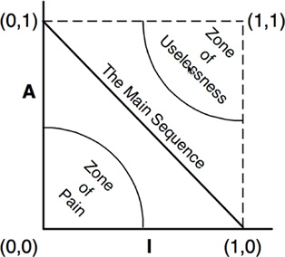

# 组件的聚合
**三个构建基本原则**
- REP: The Reuse/Release Equivalence Principle
- CCP: The Common Closure Principle
- CRP: The Common Reuse Principle

项目的重心会从三角区域的右侧开始，先期牺牲复用性，后期逐渐向三角区域左侧互动。

## REP复用/发布等同原则

软件复用最小粒度应该等同于发布的最小粒度

## CCP共同闭包原则

会同时修改，并为相同目的修改的类应放到同一组件中。
不会同时修改，并且不会为相同目的修改的类放到不同组件中。

## CRP共同复用原则

将经常共同复用的类和模块放在同一组件中，不是紧密相连的类不应该放在同一组件中。不要依赖不需要用到的东西。

# 组件耦合
## 无依赖环原则

组件依赖关系中不能出现循环依赖关系，处理方式：

- 依赖反转
- 创建新组件，将互相依赖的类全放到一个组件中

组件依赖结构图是构建性与维护性的地图，重要目标是隔离频繁的变更。组件依赖关系必须随着项目的逻辑设计一起扩张、演进。

## 稳定依赖原则(STABLE DEPENDENCIES PRINCIPLE)

**依赖关系必须指向更稳定方向**

稳定性定义
- Fan-in入向依赖：组件外部依赖组件内部类的数量
- Fan-out出向依赖：内部类依赖外部组件类的数量
- I不稳定性 = Fan-out / (Fan-in + Fan-out)
  
SDP要求每个组件的I要大于其所依赖组件的I

## SAP稳定抽象原则(STABLE ABSTRACTIONS PRINCIPLE)
**组件的抽象化程度要与其稳定性保持一致。高级策略组件要放到稳定组件中，不稳定组件应只包含我们想要快速和方便修改的部分。抽象类是足够灵活，方便被扩展。依赖的方向应该指向更抽象的方向**

SAP:
- Nc:组件中类的数量
- Na:组件中抽象类和接口的数量
- A抽象程度：A=Na/Nc
  

大部分的组件要尽可能的处在主序列线的两端位置。