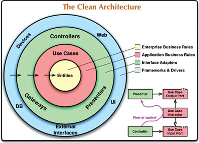
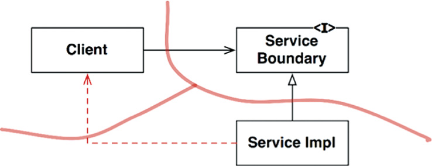
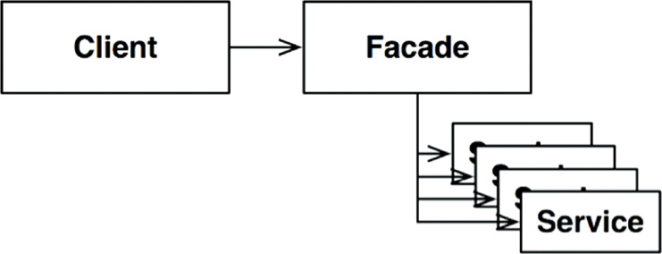

**如果想设计一个便于推进各项工作的系统，策略是在设计中尽可能长时间的保留尽可能多的选项**

良好的架构，应该可以使开发人员对系统的运行过程一目了然；该架构应该将系统中的用例、功能、必备行为设置为开发人员可见的一级实体。

所有软件系统都可以降解为策略和细节两块
- 策略是所有业务规则和操作过程
- 细节是操作系统的人、其他系统、程序员与策略交互又不影响策略的行为。（I/O 、数据库、Web系统、服务器、框架、交互协议等）

架构师的目标是创建一种系统形态，以策略为最基本的元素，并让细节与策略脱离关系，以允许在具体决策过程中推迟或延迟与细节相关的内容。如开发早期不应该考虑数据库、web服务、REST模式、框架的选择。

# 解耦DECOUPLING

## 解耦模式
1. 按层解耦
   
   水平分层：UI界面、应用独有业务逻辑、领域通用业务逻辑、数据库等

2. 按用例解耦

    按照变更原因对系统进行解耦，可以持续向系统内添加新的用例，并不影响旧有的用例

## 解耦实现方式
1. 源码层次：控制源代码模块间的依赖关系
2. 部署层次：控制部署单元间的依赖关系，实现一个模块的变更不会影响其它模块
3. 服务层次：将组件间的依赖关系降低到数据结构级别，通过网络数据包进行通信。

将系统解耦到一旦有需要就可以随时转变为服务的程度即可，让程序尽量长时间保持单体结构。

一个设计良好的架构应允许一共系统从单体结构开始，以单一文件的形式部署，然后逐渐成长为一组相互独立可部署的单元，甚至是独立的服务或者微服务。

## 边界
**架构师所追求的目标是最大限度降低构建和维护系统所需的人力资源。系统中的耦合是最消耗人力的，尤其是过早和不成熟的决策导致的耦合。设计良好的架构应不依赖于细节（框架、数据库、Web服务、工具库、依赖注入等），这些细节的决策应该是辅助性的，可以被推迟的。**

边界包括：
- UI与业务逻辑
- 数据库与业务逻辑
- 展示器与视图

**插件式架构**:系统分割为核心业务逻辑组件及与核心业务逻辑无关但负责提供必要功能的插件。低阶组件是高阶组件的插件，低阶组件依赖高阶组件，高阶组件没有低阶组件中的任何具体信息。

## 策略与层次

整体业务策略可拆分为：描述计算部分的业务逻辑，负责描述计算报告的格式，描述如何校验输入数据的策略等。架构设计的重点之一是，将这些策略彼此分离，按照变更的方式进行重组。变更原因、时间和层次相同的策略应分到同一个组件中。

**层次**:一条策略距离系统的输入/输出越远，层次越高。

数据流向和源码中的依赖关系并不总处于一个方向上，源码的依赖关系要与其数据流向脱钩，而与组件所在的层次挂钩。

## 业务逻辑

**关键业务逻辑**:不管有没有自动化系统执行该业务，业务都会执行

**关键业务数据**:这些数据无论自动化程序存在与否，都必须存在

**业务实体Entity**:关键业务逻辑和关键业务数据组合构成的对象；业务实体中只有业务逻辑，没有任何系统细节。

**用例**:关于任何操作一共自动化系统的描述，定义用户需要提供的输入数据、应得到的输出数据、产生输出所应采取的处理步骤。不描述用户界面，只描述特定情景下的业务逻辑，这些业务逻辑规范的是用户与业务实体间的交互方式，与数据流入/流出方式无关。用例本身也是一共对象，包含特定场景的业务逻辑，及输入、输出数据及相关业务实体的引用。

用例靠近输入、输出，相对业务实体是低阶概念。用例对象不应该知道数据呈现的方式，输入数据和输出数据都应该是简单的数据结构，数据结构中不应该存在依赖关系。

## 整洁的架构
良好的架构设计应该只关注用例，并它们与其他周边因素隔离。Web只是实现细节，框架只是工具，这些都不是系统本身。系统架构设计围绕用例展开，测试对象应该只是简单的业务实体对象。系统架构的特点：
- 独立于框架
- 可被测试
- 独立于UI
- 独立于数据库
- 独立于任何外部机构
  

**最内层的圆包含最通用、最高层的策略，最外层的圆包含的是最具体的实现细节。低层机制的依赖关系要指向高层策略，在图中既是指向同心圆内层。内层代码不应该引用外层圆中代码所申明的名字**

- 业务实体：可以是带有方法的对象，也可以是一组数据结构和函数的组合。只要能被系统不同应用复用即可
- 用例：特定应用场景下的业务逻辑；用例层应与业务实体和外部因素均保持隔离
- 接口适配层：通常是一组数据转换器，负责将数据从对用例和业务实体而言最方便操作的格式，转换为外部系统最方便操作的格式。这一层包含GUI MVC架构，展示器、视图、控制器。数据模型应由控制器传递给用例，再由用例传回展示器和视图。这一层代码也负责将数据从业务实体与用例而言最方便操作的格式，转化为持久性框架（如数据库）最方便的格式。从该层往内的同心圆中，代码就不应该依赖任何数据库。

跨越边界的数据在数据结构上都是简单的，不要直接传递业务实体或数据库记录对象，数据格式要采用内层最方便的使用的形式。

## 谦卑对象模式
谦卑对象模式：将易于测试的行为和难以测试的行为进行隔离。如视图与展示器。展示器是可测试的对象，负责从应用程序接收数据，按视图的需要格式化；应用程序所能控制的、要在屏幕上显示的一切东西，都应在视图模型中以字符串、布尔值或枚举形式存在。视图部分是难以测试的谦卑的对象，除了加载视图模型所需要的值，不做任何其他事情。

在系统的边界运用谦卑对象模式，可以提高系统的可测试性。

## 不完全边界
**构建完整的边界，成本很高。架构师需要考虑是否要构建完全的边界**

不完全边界构建方式有：

1. 省掉分开编译和部署：将系统中的所有接口，用于输入、输出的数据格式都设置好后，仍选择一起编译和部署为一个组件
2. 单向边界：采用策略模式，如下Client是ServiceImpl实现的ServiceBoundar接口。虚线是未来隔离的地方，依赖反转已做好。
   
3. 门户模式:Facade类作为门户类，包含一份所有服务函数的列表，负责将Client调用传递给Client不可见的服务函数。
   

## Main组件
Main用于创建所有的工厂类、策略类及其他全局设施，并将系统控制权转交给最高层抽象层的代码处理。Main组件可以视为应用程序的一个插件。

## 服务
服务本身不代表系统架构，服务并不等于解耦，任何形式的共享数据行为都会导致强耦合。大型系统一样可以用单体模式，或者组件模式，不一定非得服务化。服务也可以按照SOLID原则设计，按照组件结构部署，这样可以做到添加/删除组件时不影响服务中的其他组件。服务内部的组件边界才是架构边界，服务边界不是。